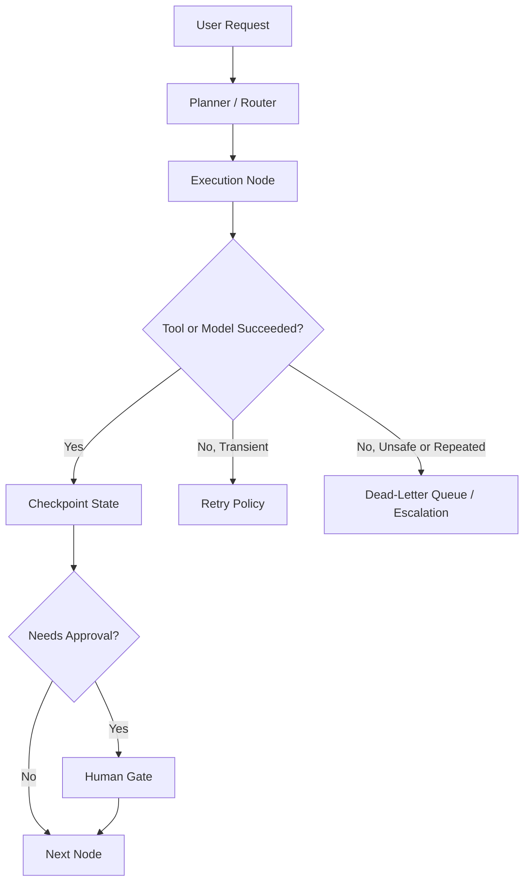

# Harness Components and Runtime Policies

The harness is the operational shell around the model. If the model is the brain, the harness is the nervous system, memory, and seatbelt.

## The minimum viable harness

A production-worthy harness usually includes:

- planner or dispatcher
- state store
- retry policy
- timeout policy
- budget guard
- approval gate
- structured logs and traces
- dead-letter path for repeated failures

## Where each piece fits



## Retries

Not every error deserves another attempt.

Retry these:

- rate limits
- temporary network failures
- known flaky provider responses

Do not blindly retry these:

- invalid tool arguments
- schema mismatch caused by bad prompt design
- budget exhaustion
- approval rejection

Sample retry policy:

```yaml
retry_policy:
  max_attempts: 3
  backoff: exponential
  retry_on:
    - http_429
    - http_503
    - socket_timeout
  do_not_retry_on:
    - schema_validation_failed
    - permission_denied
    - budget_exceeded
```

## Budgets

Budgets keep the system from turning a small task into an expensive mystery.

Track:

- total tokens
- tool cost
- elapsed time
- model tier used

Example budget scoreboard:

| Metric | Limit | Current | Action |
| --- | --- | --- | --- |
| Spend per run | $1.50 | $0.82 | continue |
| Wall clock time | 120s | 108s | warn |
| Search calls | 6 | 6 | stop fan-out |
| Model escalations | 1 | 1 | block further upgrades |

## Approval gates

Use approvals at irreversible boundaries, not everywhere.

Good approval triggers:

- sending an email
- mutating external data
- deleting files
- publishing to a customer-facing channel
- exceeding a financial threshold

Bad approval trigger:

- every low-risk read operation

Too many gates make the system unusable.

## Dead-letter handling

Repeated failure must land somewhere explicit.

Send runs to a dead-letter path when:

- retries are exhausted
- the same node fails with the same error signature
- policy rejects execution
- required human approval never arrives before timeout

Dead-letter record example:

```json
{
  "run_id": "run_2026_04_07_001",
  "failed_node": "validate_citations",
  "error_code": "schema_validation_failed",
  "attempt_count": 3,
  "budget_spent_usd": 0.91,
  "next_action": "manual_review"
}
```

## Failure containment checklist

- can the run be resumed safely
- can the operator tell what failed first
- can the system stop before wasting more budget
- can the same bug be reproduced from logs and artifacts

Continue with [Failure Walkthroughs](./04-failure-walkthroughs.md).
