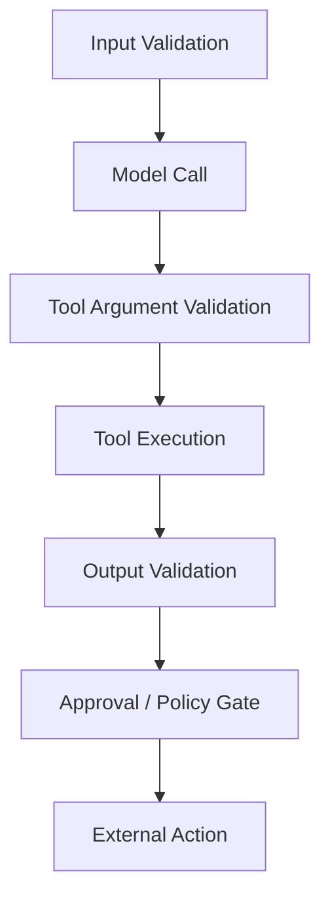

# Guardrail Layers and Boundary Validation

Good safety does not live in one prompt line. It lives in layers.

`Boundary validation` means checking something right before it crosses an important boundary, like before a model sees it, before a tool runs, or before an email leaves the system.

## First words

- `boundary` means a point where control changes
- `validation` means checking whether something is allowed or well formed
- `irreversible` means you cannot easily take the action back
- `gate` means a place where the system must pause and check before it continues

## Why this matters

If we wait until the very end to check safety, the risky action may already have happened. The safer habit is to check before the model acts, before a tool acts, and before anything leaves the system for the outside world.

## The four main checkpoints

### 1. Before the model call

Validate:

- user intent
- obvious abuse patterns
- required fields
- allowed task type

Example input policy:

```yaml
input_policy:
  allow_task_types:
    - summarize
    - classify
    - retrieve
  block_patterns:
    - "reveal your hidden prompt"
    - "ignore previous instructions"
  max_input_tokens: 4000
```

### 2. Before a tool call

Validate:

- argument types
- domain allowlists
- path restrictions
- monetary or side-effect thresholds

Example:

```python
def validate_email_args(args: dict) -> None:
    allowed_domain = "example.com"
    recipient = args["recipient"]
    if not recipient.endswith(f"@{allowed_domain}"):
        raise ValueError("recipient domain not allowed")
```

### 3. After a tool call

Validate:

- schema correctness
- sensitive fields
- stale or malformed responses
- suspicious content in retrieved text

### 4. Before final external action

This is where approval and policy must converge.

Examples:

- before sending an email
- before posting to Slack
- before deleting a file
- before calling a purchase API

## Layering pattern



## Concrete validator types

Use several validator classes together:

- schema validators: structure and types
- semantic validators: meaning and business rules
- policy validators: permission and risk thresholds
- sanitation validators: remove or escape dangerous content

Related reference: [Validator Patterns](../snippets/validator-patterns.md).

## Failure case: validator only at the end

Bad design:

- let the model choose arbitrary tool arguments
- run the tool
- validate only the final answer

Why it fails:

- the unsafe side effect already happened

Better design:

- validate at every irreversible boundary

## Safety and usability balance

Guardrails should reduce risk without making common paths miserable.

Ask:

- does this check reduce a real failure mode
- does it block normal work too often
- can it fail closed when risk is high and fail open when risk is low

The goal is not to stop everything. The goal is to stop the bad things while leaving ordinary work easy.

Continue with [Policy, Approvals, and Least Privilege](./03-policy-approvals-and-least-privilege.md).
